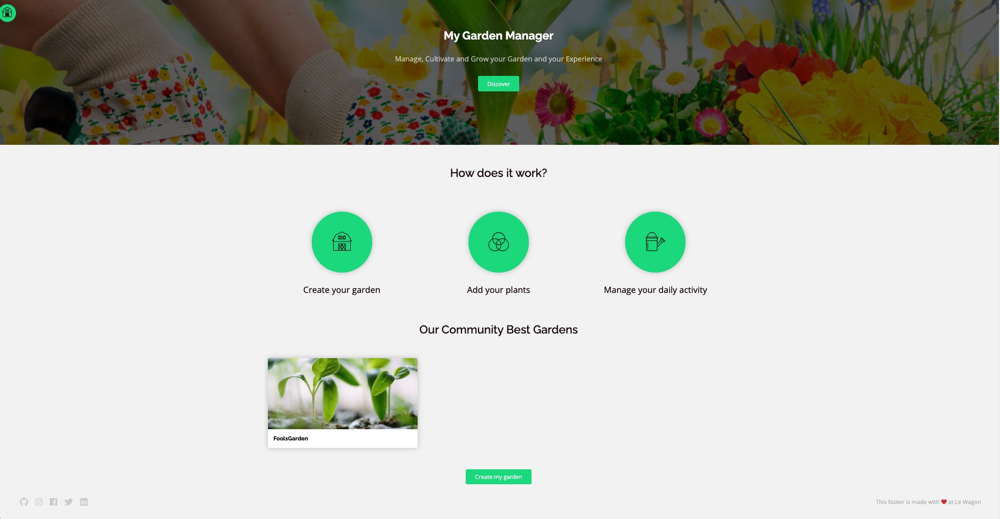

# Le Wagon Garden Manager

## Context
This application is done while [Le wagon](https://lewagon.com) Bootcamp. It's the Certification application to deploy.
We have to do differents task to create an application and deploy it on cloud provider.

## Install
```
bundle install
yarn install
rails db:create
rails db:migrate
rails db:seed
```
## Ruby on Rails Version
` rails 6.1.4.4`

## Ruby Gem
Here it is the list of Gems used in this project
### Standard Ruby on Rails Gem
* gem 'pg', '1.1'
* gem 'puma', '~> 4.1'
* gem 'sass-rails', '>= 6'
* gem 'webpacker', '~> 4.0'
* gem 'turbolinks', '~> 5'
* gem 'jbuilder', '~> 2.7'
* gem 'bootsnap', '>= 1.4.2', require: false
* gem 'pry-byebug'
* gem 'pry-rails'
* gem 'dotenv-rails'

### Addtionnal Ruby on Rails Gem
* gem 'autoprefixer-rails'
* gem 'font-awesome-sass'
* gem 'simple_form'
* gem 'devise'
* gem 'cloudinary', '~> 1.16.0'
* gem 'geocoder'
* gem 'country_select'
* gem 'select2-rails'

## Javascript plugins
* flatpickr
* mapbox
* select2
* moment

## Screeshots




## Credits
Rails app generated with [lewagon/rails-templates](https://github.com/lewagon/rails-templates), created by the [Le Wagon coding bootcamp](https://www.lewagon.com) team.
